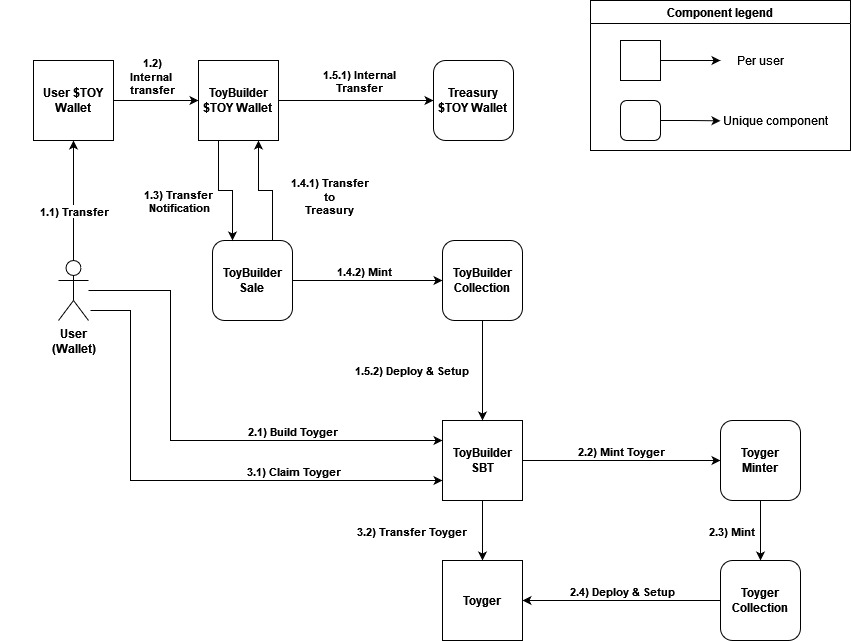

# Toygers System Version 1 (MVP)

## Overview

Toygers is a series of NFTs that represents the right to claim a physical Toyger piece IRL (In Real Life). The system consists of a component called ToyBuilder which is purchaseable by the user in order to build (Mint) Toygers of any series.  

Initially only 1 generation of ToyBuilder will be available for purchase in exchange for $TOY, the token of the Toygers project. After purchasing ToyBuilder the user can build Toygers and, after wating for a certain amount of time (build time), claim the NFT to itself (transfer to the owner of the ToyBuilder).

## Components
1. **ToyBuilder Collection** [[**file**](../contracts/token/toybuilder/collection.tact)]: Mints and holds metadata common to all ToyBuilders.
2. **ToyBuilder Item** [[**file**](../contracts/token/toybuilder/item.tact)]: SBT item with the capability of building a certain amount of Toygers to it's owner.
3. **ToyBuilder Sale** [**WIP**]: Sell ToyBuilders to users and communicates with **ToyBuilder Collection** to mint a new item.
4. **Toyger Minter** [**WIP**]: Mint Toygers of a specific series through **Toyger Collection**, upon receiving a message from a ToyBuilder.
5. **Toyger Collection** [**WIP**]: Mint Toygers and holds common metadata.
6. **Toyger Item** [**WIP**]: Collectible Toyger NFT representing a physical piece and other functionalities in the future. 

## Architectural Diagram

## Architecture Components
1. **Purchase Toybuilder**: Buyer purchases ToyBuilder by sending a message to ToyBuilderSale contract which communicates with ToyBuilderCollection and mints a ToyBuilder SBT to the buyer.
2. **Build Toyger**: ToyBuilder owner sends a message to ToyBuilder, which communicates with the Toyger builder protocol and starts the building process to the ToyBuilder owner. ToyBuilder can build one Toyger at once, unlocking this functionality again after claiming.
3. **Claim Toyger**: After building time, ToyBuilder owner sends can claim the Toyger by sending a message to it, ToyBuilder will then transfer the Toyger ownership from itself ToyBuilder to it's owner.